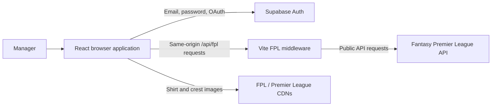
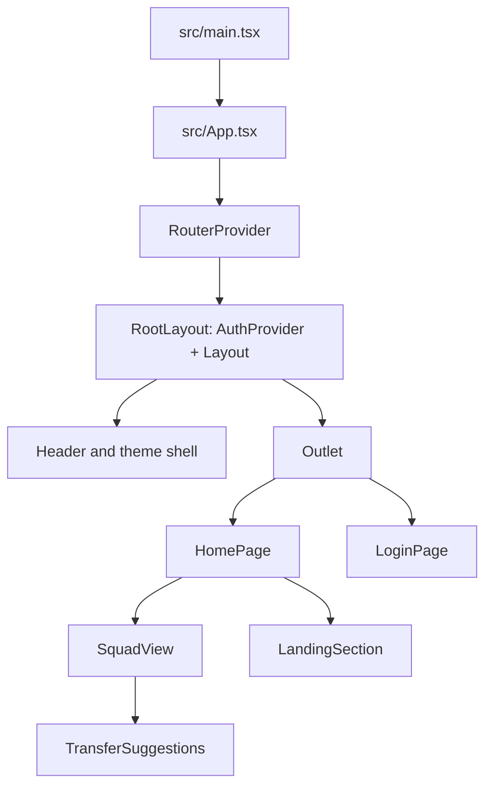

# Architecture

## Purpose and scope

FPL Team Assistant is a React single-page application that turns a public Fantasy Premier League team ID into a gameweek-focused squad analysis. The system keeps external API access, domain calculations, authentication state, and presentation concerns separate so each can evolve independently.

## System context



The browser communicates directly with Supabase Auth using the public anon key supplied by Figma Make. FPL JSON is requested through same-origin middleware during development, avoiding browser CORS restrictions and centralising cache behaviour.

## Runtime composition



`RootLayout` is the router root and mounts `AuthProvider` around `Layout`. This ensures the shared header and every route access the same auth context, including after React Router error recovery. `src/App.tsx` is intentionally limited to mounting the router.

## Frontend layers

| Layer | Location | Responsibility |
| --- | --- | --- |
| Entry point | `src/main.tsx` | Loads global styles and mounts React. |
| Routing | `src/app/routes.ts` | Defines `/` and `/login`; wraps routed content in the auth-aware root layout. |
| Page shell | `src/pages/Layout.tsx` | Header, theme preference, route transitions, footer, and outlet. |
| Pages | `src/pages/` | Own route-level loading, rendering, and navigation state. |
| Components | `src/components/` | Reusable presentation for pitch, player imagery, landing previews, squad, and transfers. |
| Domain services | `src/services/` | Pure prediction and transfer-analysis functions. |
| Contracts | `src/types.ts` | FPL API shapes and enriched application models. |

## Data retrieval and enrichment

`HomePage` coordinates a team load as an explicit state machine:

```text
idle → loading → loaded
             └→ error
```

On a valid team ID, it performs the following sequence:

1. Fetches bootstrap data and fixtures in parallel.
2. Selects the current gameweek, falling back to the next unfinished event.
3. Fetches the team picks for that gameweek.
4. Fetches a player-summary response for each selected player in parallel.
5. Builds team and player lookup maps.
6. Calculates a `PlayerPrediction` and `FixtureInfo` for each pick, producing `EnrichedPick` records.
7. Splits picks into starting XI and bench, then calculates the captain-adjusted team projection.

The `SquadData` object is the page-level boundary between retrieval/enrichment and presentation. Components consume this model rather than raw upstream responses.

## FPL middleware

`fplApiPlugin` in `vite.config.ts` intercepts `/api/fpl/*` requests while Vite is serving the application.

| Local route | Cache | Purpose |
| --- | --- | --- |
| `/api/fpl/bootstrap` | 30 minutes | Players, teams, and events |
| `/api/fpl/fixtures` | 30 minutes | Fixture schedule and difficulty |
| `/api/fpl/player/:id` | None | Player match history |
| `/api/fpl/team/:teamId/:gameweek` | None | Team picks and bank |

The middleware forwards a browser-compatible user agent and returns a consistent JSON error shape when upstream requests fail. It only applies to Vite's serve mode. A production platform must implement equivalent endpoints before the static app is deployed.

## Prediction model

`calculatePrediction` is a pure function in `src/services/prediction.ts`. It applies four steps:

1. **Recent form:** a recency-weighted average of the last five gameweeks, falling back to season points per game when necessary.
2. **Fixture context:** a difficulty multiplier plus a home-match boost.
3. **Availability and minutes:** a discount for low availability and for a five-match average below 60 minutes.
4. **Defensive contribution:** a bonus for defenders and midfielders who clear the relevant FPL `defensive_contribution` threshold in at least three of their last five appearances.

The engine returns a rounded predicted-points value, source base score, and FPL `ep_next` reference value. It does not mutate FPL data or component state.

## Transfer analysis

`analyseTransfers` in `src/services/transfers.ts` operates on already enriched squad data. It:

- Restricts candidates to the outgoing player's position.
- Excludes players already in the squad.
- Enforces the available-bank budget.
- Excludes unavailable candidates and those without FPL `ep_next` data.
- Ranks positive point deltas and evaluates a greedy two-transfer combination.
- Applies the standard four-point cost for transfers beyond the chosen free-transfer allowance.

The transfer service does not call the prediction engine. It uses current squad predictions and FPL's candidate `ep_next` values as supplied by the load flow.

## Authentication

`src/lib/supabase.ts` exports a browser-wide Supabase client singleton. Reusing the client prevents concurrent GoTrue clients from sharing the same auth storage key during hot updates.

`AuthProvider` owns the current session, user, loading state, and sign-out action. On mount it reads the existing session and subscribes to Supabase auth state changes. The public landing experience remains accessible without a session; authenticated state enables transfer suggestions and account controls.

## Styling and interaction

- Tailwind CSS v4 is loaded from `src/index.css`.
- Rajdhani is used for prominent numerical and broadcast-style display typography; DM Sans supports interface text.
- `Layout` persists the colour preference in `localStorage` and respects the system preference when no choice is stored.
- Motion animations observe `prefers-reduced-motion` through `useReducedMotion`.
- FPL imagery is loaded from official CDN URLs and has descriptive alt text plus non-image fallbacks.

## SEO and public surface

The application is an SPA, but crawler-facing assets are emitted from `public/`:

- `sitemap.xml` lists only the public landing page.
- `robots.txt` permits public crawling and excludes `/login`.
- `index.html` includes canonical and `WebApplication` JSON-LD metadata.
- `.figma/make/site.json` configures page title, description, favicon, Open Graph type, and theme colour.

No authenticated route is included in the sitemap.

## Deployment boundaries

The repository can produce a static Vite build with `pnpm run build`. Its production deployment has two responsibilities beyond static hosting:

1. Serve SPA route fallback so `/login` resolves to the application shell.
2. Provide production `/api/fpl/*` routes compatible with the Vite development middleware.

Supabase's generated project configuration and Edge Function scaffolding are managed by Figma Make. The included edge function currently exposes only health and generic key-value infrastructure; it is not the FPL API proxy.

## Operational considerations

- The FPL API is a public external dependency; upstream availability and schema changes should be handled defensively.
- Keep FPL API calls server-side in production to avoid CORS and to control cache policy.
- Treat the Supabase anon key as public configuration, but never expose service-role keys or OAuth secrets in the frontend.
- Add automated tests around prediction and transfer services before changing model coefficients or ranking logic.
